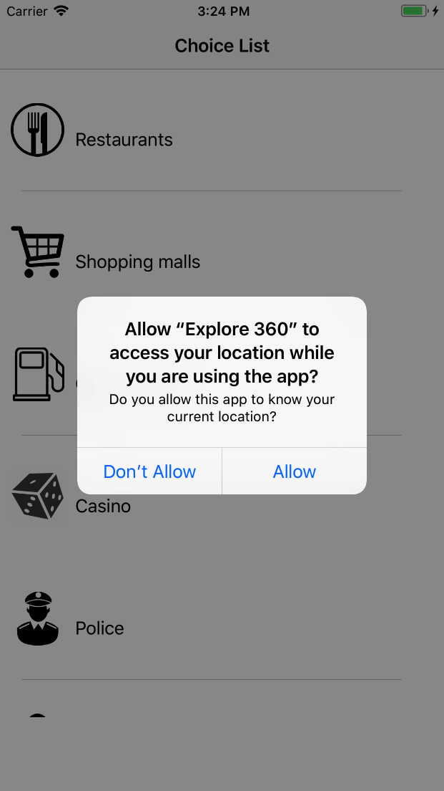
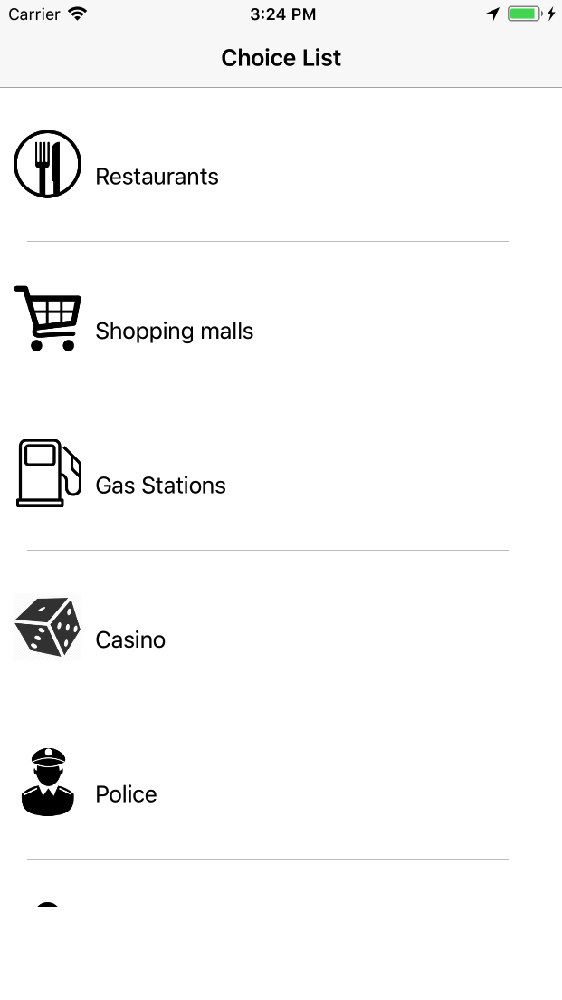
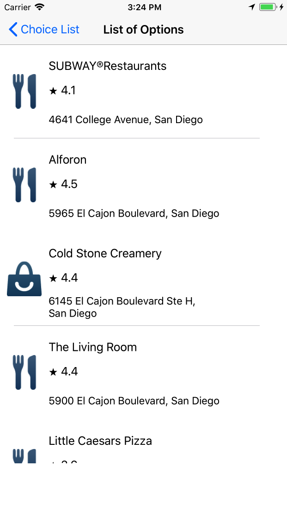
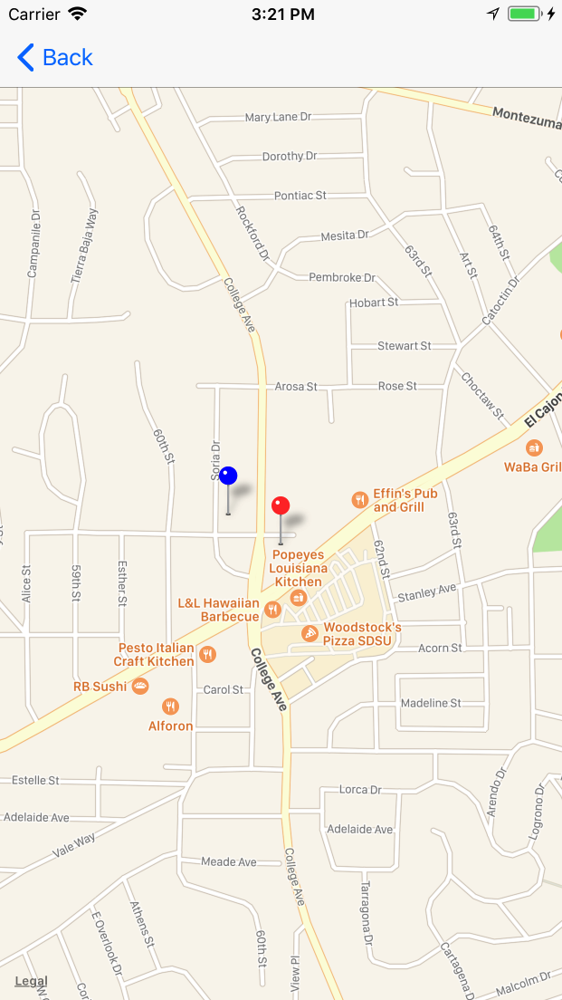

# AroundMe
This app uses the user’s current location and allows the user to check nearest restaurants, stations, doctors, etc near him according to to the choice that person selects with individual ratings and addresses. Uses CoreLocation framework and Google Places API.

# Screenshots

 

 

 

 

 

# Requirements

- Xcode 9
- iOS 11
